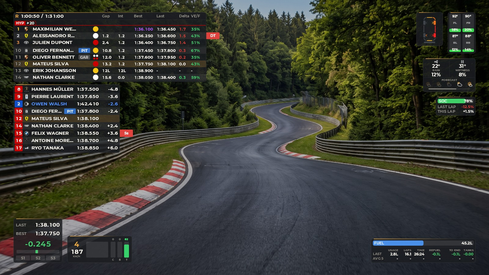
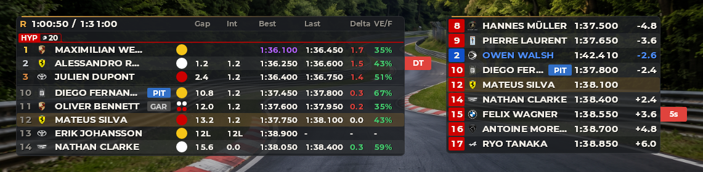
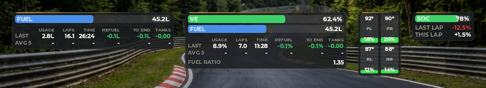
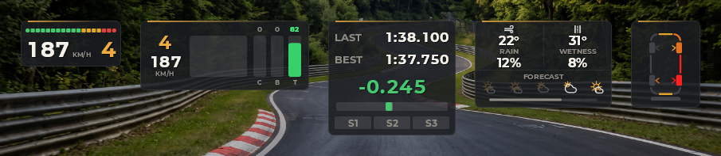
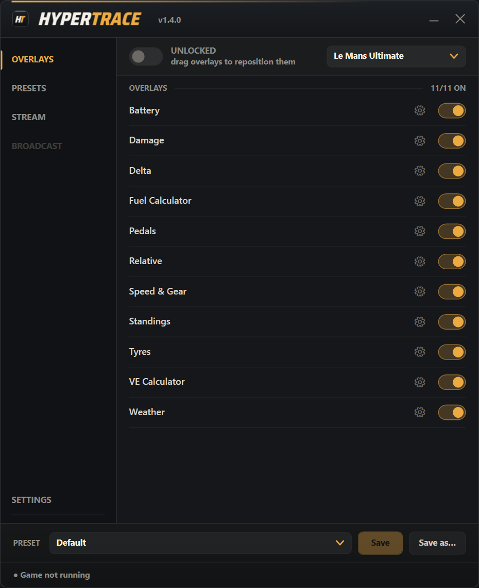
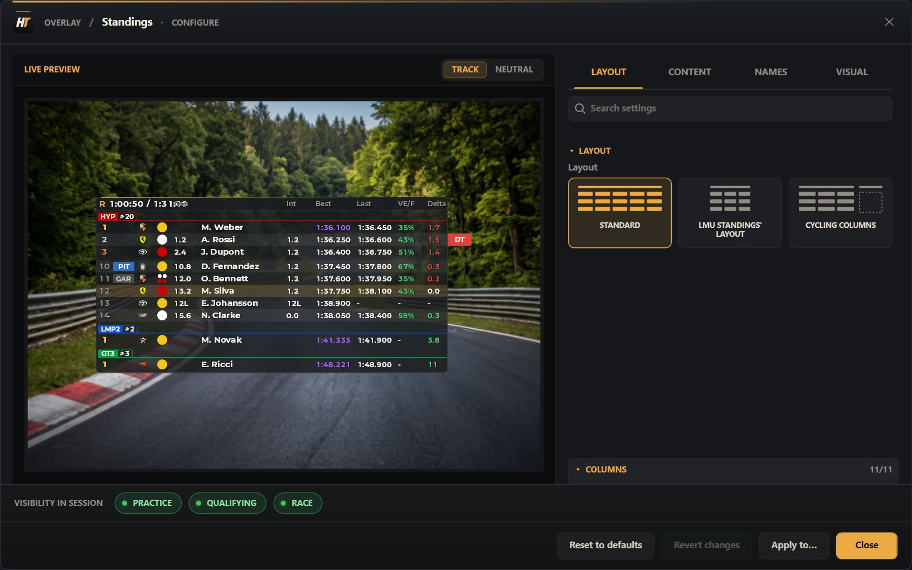

# HyperTrace

Real-time telemetry overlay app for **Le Mans Ultimate**, **iRacing** and
**Assetto Corsa** (Windows), built as a native C# (WPF) app with its own
C++ telemetry engine.

Draggable, configurable overlays sit directly on top of the game — no
alt-tabbing, no browser window.

---

## Overlays

| Overlay | Description | Games |
|---|---|---|
| **Speed & Gear** | Speed, gear and an RPM shift-light bar | all three |
| **Pedals** | Throttle / brake / clutch bars with a trace history | all three |
| **Standings** | Multi-class live standings — gaps, lap times, pit/out badges, tyre compound, manufacturer logo | all three |
| **Relative** | On-track proximity list of the drivers immediately around you, with live gaps | all three |
| **Delta** | Last lap / best lap / live delta-to-best with a gain-loss bar | all three |
| **Fuel Calculator** | Fuel level, per-lap usage, laps remaining, refuel needed and full tanks to the end | all three |
| **Battery** | Hybrid state of charge — reads zero on a car that has no hybrid system | all three |
| **Weather** | Air/track temperature, rain, track wetness, and the session forecast (LMU only) | all three |
| **Tyres** | Per-tyre carcass temperature (colour-coded to each tyre's own optimal window) and wear | LMU, Assetto Corsa |
| **Damage** | Top-down car silhouette showing body, wheel, suspension and rear-wing damage at a glance | LMU only |
| **VE Calculator** | Same as Fuel Calculator, for cars that run on Virtual Energy (Hypercar, GT3) instead of fuel | LMU only |

**Standings** and **Relative**

**Fuel Calculator**, **VE Calculator**, **Tyres** and **Battery**

**Speed & Gear**, **Pedals**, **Delta**, **Weather** and **Damage**

Overlays appear automatically when you're on track and hide when you're
not. Everything — position, size, opacity, visible columns/rows, colours —
is configurable per overlay, with a live preview right in the settings
dialog.

An overlay a game cannot feed is hidden rather than shown empty, and
comes back on its own the moment you switch to a game that can. iRacing
publishes no damage at all, its tyre readings only refresh in the pits,
and it has no virtual energy; Assetto Corsa has no damage model to read
and no virtual energy either. Standings and Weather likewise drop the
columns and the forecast a given game doesn't publish.

> **Not available in this app (yet):** Broadcast overlays and the Live
> Timing panel existed in the retired Python version — see
> [`CHANGELOG.md`](CHANGELOG.md)'s `[1.2.0]` entry. (Stream mode was in
> that same list until `[1.3.0]` brought it back.)

---

## Three games, no switch to flip

All three are watched at once. HyperTrace notices which one is running
and follows it — nothing to set, no restart, and it switches over on its
own if you close one and launch another. Each game keeps its own presets
and its own class colours. While none is running, the game picker in the
window header decides whose settings and presets you're looking at.

---

## How data is read

Telemetry comes from the game's **shared memory**.

For **Le Mans Ultimate**, a small C++ engine reads it, loaded in-process
as a DLL — not a separate process. It also enriches,
on its own background threads, a few things shared memory doesn't expose
(via LMU's local REST API and WebSocket): standings details, weather
forecast, and penalty type.

For **iRacing**, the shared-memory format is public and is read directly
from C#, with no native DLL involved.

For **Assetto Corsa**, the same — but its shared memory covers your own
car alone. The game shares nothing about the rest of the field, so
Standings and Relative are fed by a small HyperTrace app that runs inside
the game under Custom Shaders Patch and passes the field along over a
local pipe. Every other overlay works without it.

---

## Requirements

- **Le Mans Ultimate**, **iRacing** and/or **Assetto Corsa** (Windows). Assetto Corsa means the original 2014 game — not Competizione, not EVO.
- LMU only — in-game: **Settings → Gameplay → Enable Plugins** must be **ON**. This is what publishes the shared memory the app reads. If you just enabled it, **restart the game**; it doesn't take effect on an already-running session. iRacing needs no equivalent setting.
- Assetto Corsa, for Standings and Relative only — **Custom Shaders Patch**, plus the in-game app from step 3 below. Without it every other overlay still works and those two stay empty.

---

## Download & run

1. Grab the latest `HyperTrace_x.x.x.zip` and extract it anywhere.
2. Run `HyperTrace.exe`. Self-contained — nothing else to install.
3. For Assetto Corsa's Standings and Relative only: copy the `AssettoCorsa\apps` folder out of the archive into your Assetto Corsa folder, switch **HyperTrace** on in the game's app list, and leave its window open.
4. Launch (or already be in) a session in any of the games. Overlays appear automatically once you're on track.

Settings, positions and the enabled/disabled state of each overlay are
saved to `%USERPROFILE%\.hypertrace\config.json` and persist between
launches.

---

## The main window

A sidebar with four pages (Broadcast is listed but not available yet):

- **Overlays** — **Lock/Free** at the top, then a row per overlay to toggle it on/off and open its settings (gear icon, live preview included), and the preset switch/save row at the bottom.
- **Presets** — save and switch between full overlay layouts; one can be auto-loaded on startup, or per driven class. Presets are kept separately for each game, and any overlay's settings can be copied into your other presets from its own settings dialog ("Apply to…").
- **Stream** — see below.
- **Settings** — **Auto-hide** (only show overlays while driving), launch with Windows, and what closing the window does.

**Drag** any overlay to move it — it snaps to screen edges and to other overlays when they line up.

An overlay's settings open on a live preview of it, drawn by the very
code that draws the real one, so a change is visible before you go back
on track:

---

## Stream mode

The **Stream** page serves each overlay as a live web page you can add to
OBS (or anything else with a browser source), on a port of your choice.
Overlays are off for streaming until you switch them on, they keep their
transparency (no green screen), and they have their own settings and
their own auto-hide, separate from the ones on your screen — a broadcast
usually wants different sizes and columns from what you read mid-corner.

Note that this **opens a port on your machine**: while streaming is on,
the overlays are reachable from your local network, not only from this
PC. That is what lets OBS run on a second machine.

---

## Source

This repository hosts HyperTrace's releases; the source is not public. The
app is a C# (WPF) desktop shell rendering its overlays with SkiaSharp,
backed by a small C++ engine for Le Mans Ultimate's shared memory —
iRacing's and Assetto Corsa's are public formats and are read directly.

---

## Credits

HyperTrace's original Python prototype, long retired, adapted portions of
its calc engine from **TinyPedal** (GPLv3) — see
[`THIRD_PARTY_NOTICES.md`](THIRD_PARTY_NOTICES.md) for details. The
current app is an independent implementation.
